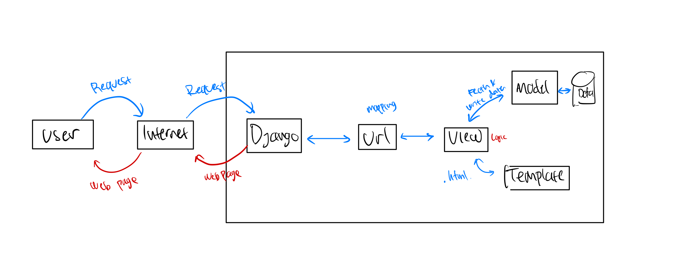
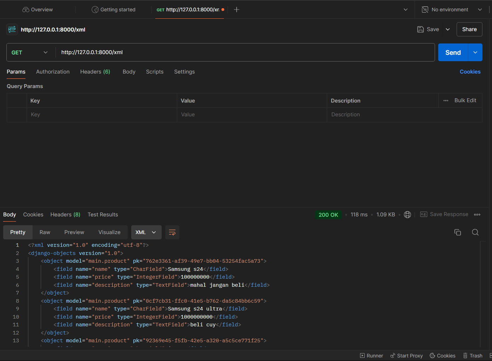
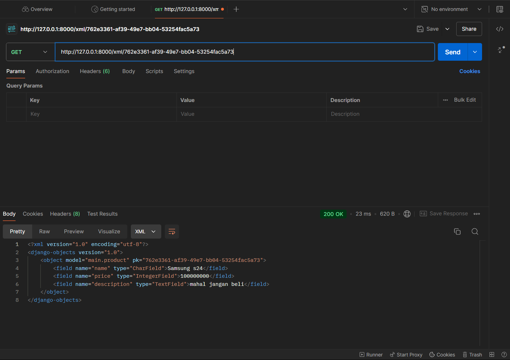
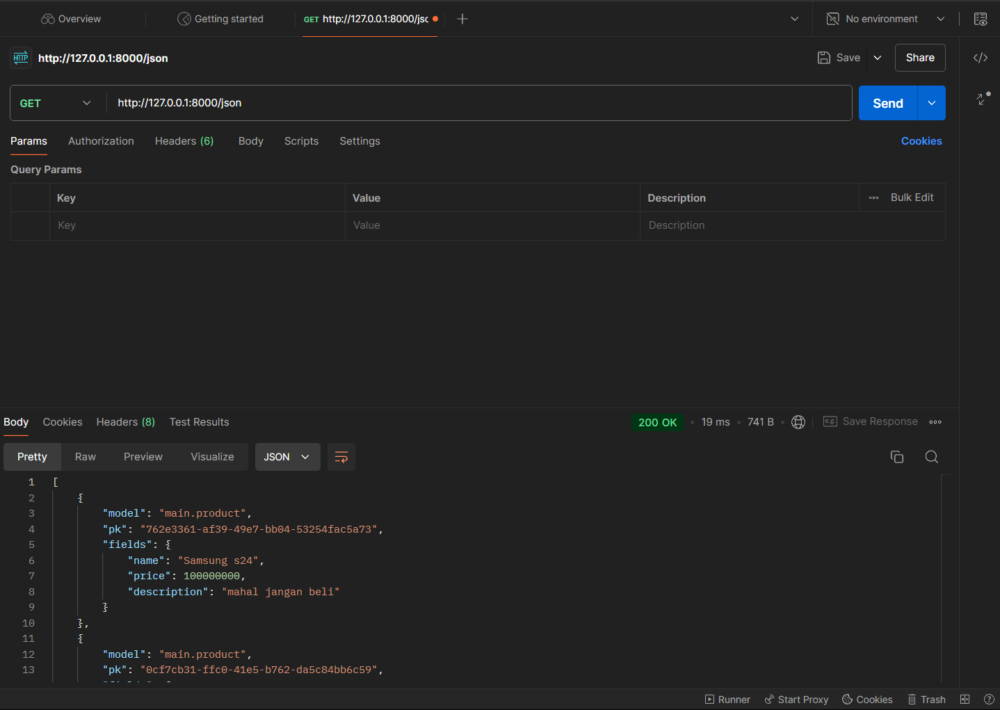
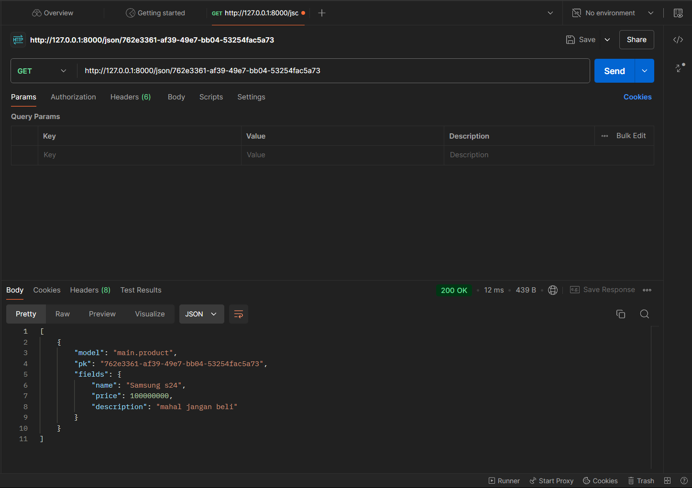
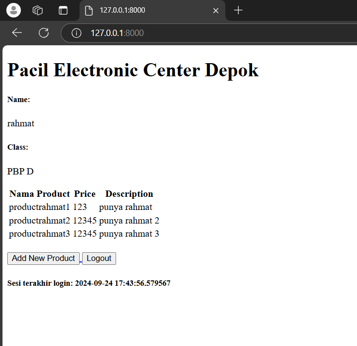
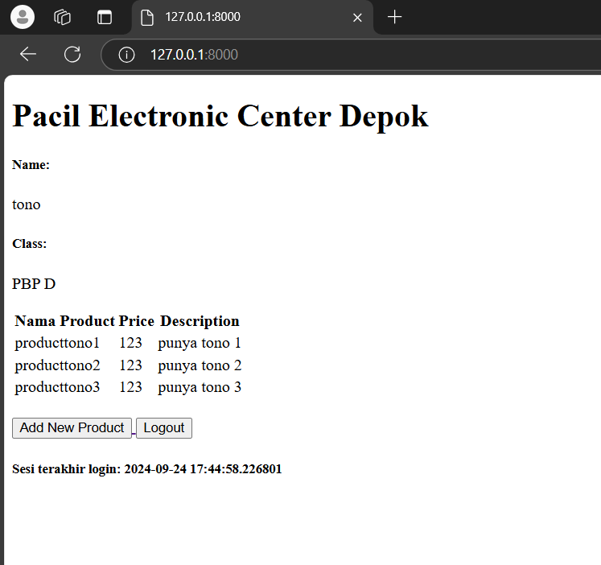
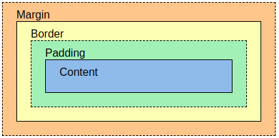

# Pacil Electronic Center

Nama : Muhammad Zaid Ats Tsabit
NPM : 2306224410
Kelas : PBP D

Nama Aplikasi : Pacil Elektronic Center ( PEC )
Link : http://muhammad-zaid31-pec.pbp.cs.ui.ac.id/

## Daftar Isi Tugas:
- [TUGAS 2](#tugas-2)
- [TUGAS 3](#tugas-3)
- [TUGAS 4](#tugas-4)
- [TUGAS 5](#tugas-5)
- [TUGAS 6](#tugas-6)

# TUGAS 2

## Cara membuat Aplikasi PEC STEP-by-STEP

### // Membuat sebuah proyek Django baru.
1. Setup Repo pada Github. Lalu, meng-clone repo tersebut ke dalam lokal komputer. Dengan melakukan ini, secara otomatis repo lokal akan terhubung dengan repo pada GitHub.
2. Membuat virtual environtment dan menyalakannya.
3. Setelah itu, membuat file requirements.txt pada direktori utama lokal dan lakukan installasi dependencies pada file requirements.txt

Isi file requeirements.txt:
django
gunicorn
whitenoise
psycopg2-binary
requests
urllib3

4. Langkah akhir membuat proyek Djanggo, dengan menjalankan perintah "django-admin startproject pec ." (pec nama proyeknya)

### // Membuat aplikasi dengan nama main pada proyek tersebut
5. Menjalankan "python manage.py startapp main" untuk membuat aplikasi main
 
### // Melakukan routing pada proyek agar dapat menjalankan aplikasi main.
6. Pada folder proyek (subnama proyek), lakukan penambahan 'main' pada file settings.py di variable INSTALLED_APPS. Dengan ini, main sudah terdaftarkan pada proyek kita

### // Membuat model pada aplikasi main dengan nama Product dan memiliki atribut wajib sebagai berikut.
7. Memodifikasi file models.py dengan class dan atau attribut yang diinginkan. Dalam kasus ini adalah, class Produk dengan attribut name, price, dan description.
8. Langkah terakhirnya, jangan lupa melakukan migrasi model yang sudah dibuat

### // Membuat sebuah fungsi pada views.py untuk dikembalikan ke dalam sebuah template HTML yang menampilkan nama aplikasi serta nama dan kelas kamu.
9. Membuat terlebih dahulu direktori templates dengan berisi file html yang ingin ditampilkan nantinya. (konteks disini: main.html)
10. Pada aplikasi main, dalam file views.py, saya menambahkan dictionary ( pada context ) untuk menyimpan variabel yang ingin ditampilkan pada templates nanti.

### // Membuat sebuah routing pada urls.py aplikasi main untuk memetakan fungsi yang telah dibuat pada views.py.
11. Melakukan routing pada file urls.py dalam direktori main, dengan menambahkan path views agar terhubung dengan context / variable yang ingin ditampilkan nantinya.
12. Melakukan konfigurasi routing pada urls proyek, hal ini dapat dilakukan dengan menambahkan path pada urls pattern sehingga urls tersebut terhubung ke tampilan main.
13. Setelah itu, konfigurasi proyek agar bisa menjalankan server. Hal ini bisa dilakukan dengan menambahkan ALLOWED_HOST pada file settings.py (localhost dan pws).

### // Melakukan deployment ke PWS terhadap aplikasi yang sudah dibuat sehingga nantinya dapat diakses oleh teman-temanmu melalui Internet.
13. Membuat Project pada PWS dan menghubungkan direktori lokal
14. Melakukan mantra git add, commit, push kepada GitHub dan PWS

Setelah melakukan hal tersebut, taraa~~ jadi deh proyeknya


## Buatlah bagan yang berisi request client ke web aplikasi berbasis Django beserta responnya dan jelaskan pada bagan tersebut kaitan antara urls.py, views.py, models.py, dan berkas html.



Request user akan diteruskan kepada framework Django di mana disana request akan dipetakan melalui urls.py untuk diarahkan kepada views.py yang diinginkan. Setelah diterima oleh views.py, request tersebut akan diproses dengan mengambil/menulis data pada models.py karena hal tersebut merupakan bagian dari database. Lalu, setelah mengambil/menulis data, maka views kembali memproses templates yang berisi html untuk menampilkan display yang diinginkan. Setelah semua data tersebut didapatkan, maka semua  hasil tersebut akan diteruskan dan ditampilkan pada user.


## Jelaskan fungsi git dalam pengembangan perangkat lunak!

Dalam pengembangan perangkat lunak, *pada umumnya* dilakukan oleh dua orang atau lebih sehingga dengan adanya git kita dapat melakukan kolaborasi dan kerjasama antar pengembang, tanpa harus khawatir dengan perubahan yang akan mereka buat akan saling bertabrakan, dengan cara branching. Selain itu, dengan git para pengembang juga dapat melihat riwayat atau history dari perubahan-perubahan yang ada karena dapat dilihat dari commitnya. Hal ini, tentulah sangat bermanfaat untuk tracking perubahan atau versi yang telah diubah/diupdate. Jika terjadi konflik pada perubahan pun, para pengembang bisa menyelesaikan / meresolvenya dengan mudah.

## Menurut Anda, dari semua framework yang ada, mengapa framework Django dijadikan permulaan pembelajaran pengembangan perangkat lunak?

Menurut saya, Django dapat menjadi pintu masuk utama yang relatif lebih mudah dicerna karena dari segi bahasa yang digunakan aja sudah lebih enak dimengerti, yaitu python. Lalu, dengan arsitekturnya yang berbasis Model-View-Template (MVT), yang mana arsitektur ini memisahkan komponen logika aplikasi, tampilan, dan pengelolaan data sehingga akan mudah dicerna secara intuitif untuk mempelajari pengembahan perangkat lunak ini.

## Mengapa model pada Django disebut sebagai ORM?

Model pada Django disebut sebagai ORM karena Django pakai Object-Relational Mapping buat ngehubungin antara model yang kita bikin di Python sama tabel di database. Jadi, kita bisa ngatur data di database cukup dengan kode Python aja tanpa perlu repot-repot nulis SQL manual. Dengan ORM ini, semuanya jadi lebih gampang dan enak dimengerti, terutama jika kita yang pingin fokus ke logika aplikasi tanpa pusing mikirin detail interaksi dengan database.

# TUGAS 3

## Implementasi Tugas 3

### Menyiapkan Kerangka HTML
1. Melakukan penambahan base.html pada direktori baru, yaitu templates pada root folder dan mendaftarkannya pada  Templates settings.
2. Mengubah primary key menjadi uuid pada class model agar id unik dan aman. Lalu, mengmigrasikannya.

### Membuat input form untuk menambahkan objek model pada app sebelumnya + Routing
3. Membuat file baru, forms.py, pada aplikasi atau direktori main. Lalu, mengassign model yang akan digunakan yaitu product dan field yang akan diisi pada form.

```
from django.forms import ModelForm
from main.models import Product

class ProductForm(ModelForm):
    class Meta:
        model = Product
        fields = ["name", "price", "description"]
```

4. Pada file views.py, menambahkan fungsi baru yaitu create_product dengan isi menampilkan halaman form input data yang mana jika berhasil akan kembali ke menu utama.

5. Lalu, pada fungsi show_main pada views.py, ambil seluruh database dalam product dan menggsingnya kedalam dictionary context untuk di render.

6. Menambahkan pada direktori main/templates, create_product.html, dengan mengextend base.html isi pada halaman tersebut adalah menampilkan input form database. Lalu, menambahkan code untuk menampilkan product pada main.html.

7. Melakukan routing pada main/urls.py agar create_product.html dapat terakses.

###  Tambahkan 4 fungsi views baru untuk melihat objek yang sudah ditambahkan dalam format XML, JSON, XML by ID, dan JSON by ID.
8.  Menambahkan fungsi pada views.py untuk dapat melihat format XML, JSON, XML by ID, dan JSON by ID

```
def show_xml(request):
    data = Product.objects.all()
    return HttpResponse(serializers.serialize("xml", data), content_type="application/xml")

def show_json(request):
    data = Product.objects.all()
    return HttpResponse(serializers.serialize("json", data), content_type="application/json")

def show_xml_by_id(request, id):
    data = Product.objects.filter(pk=id)
    return HttpResponse(serializers.serialize("xml", data), content_type="application/xml")

def show_json_by_id(request, id):
    data = Product.objects.filter(pk=id)
    return HttpResponse(serializers.serialize("json", data), content_type="application/json")
```

Pada show xml dan json, sebelum mereturn hasil data dalam bentuk xml/json, kita perlu mengambil seluruh data pada product baru menambahkannya pada parameter serialize agar diconvert kedalam bentuk xml/json. Hal ini berbeda pada by id di mana kita mengambil data hanya dengan id yang kita inginkan.

9. Melakukan routing pada main/urls.py agar kita dapat menampilkan halaman-halaman tersebut

```
urlpatterns = [
    path('', show_main, name='show_main'),
    path('create-product', create_product, name='create_product'),
    path('xml/', show_xml, name='show_xml'),
    path('json/', show_json, name='show_json'),
    path('xml/<str:id>/', show_xml_by_id, name='show_xml_by_id'),
    path('json/<str:id>/', show_json_by_id, name='show_json_by_id'),
]
```
Diatas adalah bentuk akhir routing pada Tugas 3 kali ini.

## Jelaskan mengapa kita memerlukan data delivery dalam pengimplementasian sebuah platform?

Sebuah platform itu membutuhkan suatu cara untuk mengirimkan data antara server dan client. Nah sehingga dengan data delivery inilah yang memungkinkan server mengirim data ke client atau sebaliknya untuk ditampilkan/diolah. Tanpa data delivery, suatu platform akan kesulitan dalam menyamakan data ( jika terdapat perubahan atau penambahan/pengurangan ) sehingga nantinya tidak akan bisa mengupdate informasi/data secara real-time dan dapat menimbulkan kebingungan dalam segi database. Oleh karena itu, kita memerulkan data delivery dalam mengimplementasikan sebuah platform.

## Menurutmu, mana yang lebih baik antara XML dan JSON? Mengapa JSON lebih populer dibandingkan XML?

Menurut saya pribadi, JSON lebih baik dari pada XML karena dari sintaksnya aja lebih mudah dibaca dibanding XML dan juga self describing. Dengan format dictionary,  value yang ada pada data JSON ini kita bisa mengambilnya dengan relatif lebih mudah, contohnya kita bisa memanggil keynya dalam bahasa python. Selain itu, pada umumnya juga JSON lebih sering digunakan dalam pengembahan di berbagai aplikasi.

## Jelaskan fungsi dari method is_valid() pada form Django dan mengapa kita membutuhkan method tersebut?

Method is_valid() ini digunakan untuk memvalidasi data yang diinput oleh user, dengan method ini kita dapat memastikan bahwa data yang diinput telah sesuai, misal field sudah terisi semua, tipe data yang sesuai, dan batas panjang yang sesuai. Jika valid, method ini mengembalikan nilai True dan data dapat disimpan atau diproses. Validasi ini tentunya sangatlah penting agar data yang diterima sesuai dengan apa yang kita harapkan dan tentunya dapat mencegah kesalahan atau bahkan keamanan suatu aplikasi, terutama bagian datanya.

## Mengapa kita membutuhkan csrf_token saat membuat form di Django? Apa yang dapat terjadi jika kita tidak menambahkan csrf_token pada form Django? Bagaimana hal tersebut dapat dimanfaatkan oleh penyerang?

Kita membutuhkan csrf_token untuk melindungi aplikasi dari serangan Cross-Site Request Forgery ( CSRF ), di mana penyerang bisa menyamar sebagai user yang valid, lalu mengirimkan sebuah request "sah" yang berbahaya tanpa sepengatahuan user. Request ini bisa dimanfaatkan oleh penyerang untuk mengobrak-abrik data pengguna, bahkan dapat merugikan pengguna secara langsung jika terkait dengan form transaksi.

## hasil akses URL pada Postman

### Show XML


### Show XML by Id


### Show JSON


### Show JSON by Id


# TUGAS 4

## Apa perbedaan antara HttpResponseRedirect() dan redirect() ?

Perbedaanya terletak pada kebutuhan dan kemudahan yang kita inginkan, tetapi keduanya tetaplah memiliki yang sama, yaitu mengdirect kepada suatu url tujuan. Jika kita ingin menggunakan HttpResponseRedirect(), kita perlu menuliskan path secara jelas dan lengkap, seperti:

```python
def contoh_view(request):
    return HttpResponseRedirect('/main/contoh_url/')
```
Hal ini berguna jika kita ingin lebih jelas dan memiliki kontrol path secara manual. Sedangkan, redirect kita bisa hanya menuliskan path namenya saja, hal ini berguna jika ingin lebih mudah menuliskan path jika path tersebut panjang atau kompleks.

```python
def contoh_view(request):
    return redirect('app_name:view_name')
```
## Jelaskan cara kerja penghubungan model Product dengan User!

Dengan melakukan penambahan, 
```python
 user = models.ForeignKey(User, on_delete=models.CASCADE)
 ```
pada model kita, dalam konteks hal ini adalah Product(). Kita menghubungkan model Product dengan satu user, di mana ForeignKey digunakan untuk membuat relasi, yang mana satu user dapat memiliki banyak Product.

Lalu, dengan penambahan pada fungsi create_product, kita dapat menyimpan suatu Product pada user yang sedang melakukan login.
Disni penambahannya adalah, 

```python
product = form.save(commit=False)
product.user = request.user
product.save()
```
sehingga secara keseluruhan seperti ini.

```python
def create_product(request):
    form = ProductForm(request.POST or None)

    if form.is_valid() and request.method  == "POST":
        product = form.save(commit=False)
        product.user = request.user
        product.save()
        return redirect('main:show_main')
    
    context = {'form': form}
    return render(request, 'create_product.html', context)
```

Dan yang terakhir dengan melakukan filtering kita bisa hanya menampilkan list product yang dibuat oleh user terkait. Pada saat pengambilan object product.

```python
products =Product.objects.filter(user=request.user)
```

## Apa perbedaan antara authentication dan authorization, apakah yang dilakukan saat pengguna login? Jelaskan bagaimana Django mengimplementasikan kedua konsep tersebut.

**Authentication** adalah proses memverifikasi identitas user, seperti mengecek apakah username dan password cocok, sedangkan **authorization** adalah menentukan hak akses user setelah mereka terotentikasi, yaitu apa saja yang boleh dilakukan atau diakses oleh user tersebut. Saat user login, Django melakukan authentication dengan memeriksa kredensial user terkait dan membuat sesi untuk user yang valid dengan login(). Setelah itu, authorization dilakukan dengan memeriksa apakah user memiliki izin untuk mengakses halaman atau fitur tertentu, seperti melalui decorator @login_required atau sistem permissions yang ada.

contoh :
```python
# Create your views here.
@login_required(login_url='/login')
def show_main(request):
    products =Product.objects.filter(user=request.user)

    context = {
        'name_aplication': 'Pacil Electronic Center Depok',
        'name': request.user.username,
        'class': 'PBP D',
        'list_product' : products,
        'last_login' : request.COOKIES['last_login'],
    }
    return render(request, "main.html", context)
```

## Bagaimana Django mengingat pengguna yang telah login? Jelaskan kegunaan lain dari cookies dan apakah semua cookies aman digunakan?

Cara Djanggo mengingat user yang telah login adalah dengan menggunakan session cookies. Setelah user berhasil login, Django membuat sesi yang diidentifikasi oleh sessionid, yang disimpan dalam cookie di browser user. Pada setiap permintaan berikutnya, cookie ini dikirimkan kembali ke server, memungkinkan Django mengidentifikasi user yang sedang login. Selain itu, cookie dapat digunakan untuk menyimpan data lain seperti last_login untuk menampilkan waktu login terakhir user. Dalam tugas kali ini pengimplementasiannya adalah dengan cara berikut:

```python
def login_user(request):
   if request.method == 'POST':
      form = AuthenticationForm(data=request.POST)

      if form.is_valid():
            user = form.get_user()
            login(request, user)
            response = HttpResponseRedirect(reverse("main:show_main"))
            response.set_cookie('last_login', str(datetime.datetime.now()))
            return response

   else:
      form = AuthenticationForm(request)
   context = {'form': form}
   return render(request, 'login.html', context)
```

Dengan mengset cookies pada response yang dilakukan oleh user. Lalu, kita juga bisa menyimpan kapan user melakukan loginnya. Dalam hal ini, data tersebut dimasukan pada variable 'last_login'

Terkait apakah semua cookies aman digunakan? menurut saya tidak semuanya karena jika kita tidak hati-hati dalam menggunakan cookies semisal dengan mengakses halaman yang tidak aman atau secure, seperti http saja. Ada kemungkinan cookies kita dapat diambil oleh orang yang tidak bertanggung jawab sehingga dengan penyerang tersebut mengambil cookies kita, mereka bisa saja melakukan request atau masuk kedalam sistem tanpa melakukan otentifikasi karena sistem menganggap request yang masuk adalah request yang sah.

## Implementasi Tugas 4

Implementasi yang dilakukan memiliki step yang hampir sama. Menambahkan fungsi views -> membuat templates halaman -> routing halaman

### Mengimplementasikan fungsi registrasi
1. Mengimport hal yang dibutuhkan untuk form registrasi dan menambahkan fungsi pada views.py pada aplikasi main
```python
from django.contrib.auth.forms import UserCreationForm
from django.contrib import messages

def register(request):
    form = UserCreationForm()

    if request.method == "POST":
        form = UserCreationForm(request.POST)
        if form.is_valid():
            form.save()
            messages.success(request, 'Your account has been successfully created!')
            return redirect('main:login')
    context = {'form':form}
    return render(request, 'register.html', context)

```
2. Lalu, menambahkan templates untuk halaman registrasi, register.html, dan melakukan routing untuk registrasi pada urls.py di aplikasi main.

### Mengimplementasikan fungsi Login
1. Sama halnya pada registrasi, kita perlu mengimport form untuk login dan menambahkan fungsi pada views.py pada aplikasi main
```python
from django.contrib.auth.forms import UserCreationForm, AuthenticationForm
from django.contrib.auth import authenticate, login

def login_user(request):
   if request.method == 'POST':
      form = AuthenticationForm(data=request.POST)

      if form.is_valid():
            user = form.get_user()
            login(request, user)
            return redirect('main:show_main')

   else:
      form = AuthenticationForm(request)
   context = {'form': form}
   return render(request, 'login.html', context)
```
2. Lalu, menambahkan templates untuk halaman login, login.html, dan melakukan routing untuk login pada urls.py di aplikasi main

### Mengimplementasikan fungsi Logout
1. Menambahkan logic logout pada views.py pada aplikasi main dan mengimport library yang dibutuhkan.
```python
from django.contrib.auth import logout

def logout_user(request):
    logout(request)
    return redirect('main:login')
```
2. Namun kita tidak perlu membuat, halaman khusus untuk logout, kita bisa menambahkan potongan kode pada halaman yang diinginkan, dalam kasus ini adalah main.html.
```python
<a href="">
  <button>Logout</button>
</a>
```
3. Melakukan routing untuk fungsi views logout pada urls.py aplikasi.

### Meretriksi halaman main
```python
from django.contrib.auth.decorators import login_required
...
@login_required(login_url='/login')
def show_main(request):
...
```

dengan melakukan hal diatas kita dapat menjadikan halaman main.html menjadi khusus untuk user yang berhasil login sehingga halaman main dapat teretriksi.

#### Mengingat pengguna dengan data dari Cookies dan menampilkan Last Login

Kita bisa menambahkan datetime yang dapat berguna dalam menuliskan kapan user login. Lalu dengan membuat object response kita bisa mengset cookie kita dengan informasi kapan loginnya. Lalu, mengreturn fungsi halaman yang diinginkan.

```python
import datetime
from django.http import HttpResponseRedirect
from django.urls import reverse

def login_user(request):
   if request.method == 'POST':
      form = AuthenticationForm(data=request.POST)

      if form.is_valid():
            user = form.get_user()
            login(request, user)
            response = HttpResponseRedirect(reverse("main:show_main"))
            response.set_cookie('last_login', str(datetime.datetime.now()))
            return response

   else:
      form = AuthenticationForm(request)
   context = {'form': form}
   return render(request, 'login.html', context)

```
Lalu, jika kita ingin menampilkan waktu terakhir login, kita bisa menambahkan dictionary berikut pada context pada show_main dan menampilkannya pada halaman yang diinginkan, dalam kasus ini main.html. Jangan lupa merubah dictionary name dengan username user
```python
'name': request.user.username,
'last_login': request.COOKIES['last_login'],
```


Dan terakhir kita bisa menambahkan kode berikut pada fungsi logout agar cookie terakhir login terhapus
```python
def logout_user(request):
    logout(request)
    response = HttpResponseRedirect(reverse('main:login'))
    response.delete_cookie('last_login')
    return response
```

### Menghubungkan model Product dengan User.
Pada models.py, kita bisa mengimport user  dan menambahkan potongan kode berikut untuk mengikat suatu model dengan suatu user
```python
from django.contrib.auth.models import User

class Product(models.Model):
    user = models.ForeignKey(User, on_delete=models.CASCADE)
...

```
Dan di fungsi membuat produk pada views.py, kita perlu menyimpan produk yang dibuat kepada user yang berkaitan. Denngan form yang disave pada request.user.
```python
def create_product(request):
    form = ProductForm(request.POST or None)

    if form.is_valid() and request.method  == "POST":
        product = form.save(commit=False)
        product.user = request.user
        product.save()
        return redirect('main:show_main')
    
    context = {'form': form}
    return render(request, 'create_product.html', context)
```

Lalu, terakhir menampilkan product yang telah difilter sehingga menampilkan product yang hanya dibuat user terkait.
```python
def show_main(request):
    products =Product.objects.filter(user=request.user)
...
```

Dengan melakukan step diatas, kita berhasil menghubungkan model Product dengan User.

## 2 Akun dengan 3 product dummy




# TUGAS 5

## Jika terdapat beberapa CSS selector untuk suatu elemen HTML, jelaskan urutan prioritas pengambilan CSS selector tersebut!

Jika terdapat beberapa CSS selector pada elemen HTML, maka browser kita akan menentukannya berdasarkan tingkat specifity ("spesifik" atau seberapa "kuat" sebuah selector dalam menerapkan gaya pada elemen HTML). Urutan pertama adalah Inline style, di mana menggunakan antribut style pada HTMLnya. 
```html
<div style="color: red;">Contoh Inline Style</div>
```

Lalu, yang kedua adalah ID selector, di mana kita menambahkannya pada tag HTMLnya
```html
<body>
  <div id="header">
    <h1>Bermain bersama ID header</h1>
  </div>
  ...
</body>
```

```css
#header {
  background-color: #a3b90e;
  margin-top: 0;
  padding: 20px 20px 20px 40px;
}
```

Dan yang ketiga adalah Class, pseudo-class, dan attribute selector. hal ini mirip ID selector, kita dapat menambahkan tag class pada HTML dan memilihnya pada file css kita.
```css
.content_section {
  background-color: #112a33;
  margin-bottom: 30px;
  color: #0F0F0F;
  font-family: cursive;
  padding: 20px 20px 20px 40px;
}
```

Yang keempat adalah Type selector (tag selector) dan pseudo-elements (seperti ::before dan ::after). Di mana kita memilih secara spesifik style pada tag HTML.
```css
p {
  color: black;
}
```
Dan yang terakhir adalah Universal selector (*). Di mana selector ini memiliki tingkatan paling rendah karena selector ini menerapkan CSS pada semua elemen dalam halaman web kita.
```css
* {
  margin: 0;
  padding: 0;
}
```

## Mengapa responsive design menjadi konsep yang penting dalam pengembangan aplikasi web? Berikan contoh aplikasi yang sudah dan belum menerapkan responsive design!

Responsive design sangatlah penting karena kita harus melihat dari sudut pandang user. Di mana user tidak semuanya akan mengakses aplikasi web kita dengan 1 device saja, semisal komputer/laptop saja. Ada kemungkinan di mana user mengakses aplikasi web kita pada mobile phonesnya mereka. Jika kita tidak menerapkan responsive design, tentunya akan sangat menyulitkan user dan mengurangi experiencenya dalam menggunakan aplikasi web kita. Oleh karena itu, kita perlu memastikan dalam pengembangan aplikasi web bahwa tampilan dan fungsionalitasnya dapat beradaptasi dengan berbagai ukuran layar dan perangkat sehingga experience user akan maksimal.

Contoh aplikasi yang sudah menerapkan responsive design, Facebook, Scele, Netflix, dan masih banyak lagi. Sedangkan yang belum menerapkan responsive design, Tokopedia (tidak bisa menyesuaikan pada desktop saya), kaskus, dan website jadul.

## Jelaskan perbedaan antara margin, border, dan padding, serta cara untuk mengimplementasikan ketiga hal tersebut!


Margin adalah area kosong di luar elemen yang memisahkannya dari elemen lain. Sedangkan, border adalah garis di sekitar elemen yang terletak antara margin dan padding, di mana ia membungkus padding dan contentnya. Lalu, padding adalah ruang di dalam elemen, antara konten elemen (seperti teks) dan border. Di mana ketiganya digunakan bersama untuk menentukan jarak dan struktur elemen pada halaman web, di mana margin mengatur ruang luar, padding mengatur ruang dalam, dan border membatasi elemen.

```css
    .contoh_box {
      margin: 20px;
      padding: 10px;
      border: 2px solid blue;
    }
```

##  Jelaskan konsep flex box dan grid layout beserta kegunaannya!

Flexbox dan Grid Layout merupakan dua konsep dalam CSS yang sangat berguna untuk mengatur tata letak elemen di halaman web kita. Flexbox digunakan untuk mengatur elemen dalam satu baris atau kolom secara fleksibel sehingga elemen-elemen tersebut bisa menyesuaikan ukuran dan posisi sesuai dengan layar yang digunakan oleh user nantinya. Nah, hal ini cocok ketika kita ingin mengatur tata letak yang lebih sederhana, seperti menyusun menu atau galeri gambar. Sedangkan, Grid Layout lebih cocok untuk tata letak yang lebih kompleks karena memungkinkan kita untuk mengatur elemen dalam beberapa baris dan kolom sekaligus. Dengan Grid, kita bisa membuat layout halaman web seperti header, sidebar, dan konten utama dengan lebih terstruktur. Keduanya sangat membantu dalam membuat aplikasi web yang responsif sehingga tampilan tetap rapi di berbagai ukuran layar user nantinya.

## Implementasi Tugas 5

1. Menambahkan logic edit_product pada views.py sehingga hal ini nantinya akan berfungsi untuk merender halaman edit product.
```python
def edit_product(request, id):
    # Get product entry berdasarkan id
    product = Product.objects.get(pk = id)

    # Set product entry sebagai instance dari form
    form = ProductForm(request.POST or None, instance=product)

    if form.is_valid() and request.method == "POST":
        # Simpan form dan kembali ke halaman awal
        form.save()
        return HttpResponseRedirect(reverse('main:show_main'))

    context = {'form': form}
    return render(request, "edit_product.html", context)
```
Notes: Perlu mengimport reverse dan HttpResponseRedirect terlebih dahulu

Setelah menambahkan fungsi tersebut, saya membuat edit_product.html untuk halamannya dan menyambungkannya pada urls.py
```python
path('edit-product/<uuid:id>', edit_product, name='edit_product'),
```

2. Menambahkan logic delete_product pada views.py, yang mana hal ini akan berfungsi untuk mendelete product.
```python
def delete_product(request, id):
    # Get product berdasarkan id
    product = Product.objects.get(pk = id)
    # Hapus mood
    product.delete()
    # Kembali ke halaman awal
    return HttpResponseRedirect(reverse('main:show_main'))
```

Setelah itu. melakukan routing pada ulrs.py dan terakhir menambahkan button untuk edit dan delete pada halaman yang diinginkan, dalam proyek ini di dalam main.html.
```python
path('delete/<uuid:id>', delete_product, name='delete_product'),
```

3. Pada proyek ini saya menggunakan Tailwind sehingga perlu menambahkan tailwind terlebih dahulu pada base.html.
```html

<!DOCTYPE html>
<html lang="en">
  <head>
    
    <meta charset="UTF-8" />
    <meta name="viewport" content="width=device-width, initial-scale=1.0" />
    
    <script src="https://cdn.tailwindcss.com"></script>
    <link rel="stylesheet" href=""/>
  </head>

  <body>
     
  </body>
</html>
```

Pada base.html tersebut saya juga menambahkan static/css/global.css dimana sebelum hal tersebut saya mengkonfigurasi static filesnya terlebih dahulu pada settings.py
```python
MIDDLEWARE = [
    'django.middleware.security.SecurityMiddleware',
    'whitenoise.middleware.WhiteNoiseMiddleware', #Tambahkan tepat di bawah SecurityMiddleware
    ...
]
```
```python
STATIC_URL = '/static/'
if DEBUG:
    STATICFILES_DIRS = [
        BASE_DIR / 'static' # merujuk ke /static root project pada mode development
    ]
else:
    STATIC_ROOT = BASE_DIR / 'static' # merujuk ke /static root project pada mode production
```

Lalu, pada direktori root static/css dalam global.css saya menambahkan

```css
.form-style form input, form textarea, form select {
    width: 100%;
    padding: 0.5rem;
    border: 2px solid #bcbcbc;
    border-radius: 0.375rem;
}
.form-style form input:focus, form textarea:focus, form select:focus {
    outline: none;
    border-color: #674ea7;
    box-shadow: 0 0 0 3px #674ea7;
}
@keyframes shine {
    0% { background-position: -200% 0; }
    100% { background-position: 200% 0; }
}
.animate-shine {
    background: linear-gradient(120deg, rgba(255, 255, 255, 0.3), rgba(255, 255, 255, 0.1) 50%, rgba(255, 255, 255, 0.3));
    background-size: 200% 100%;
    animation: shine 3s infinite;
}
```
Dengan mengsetup hal-hal diatas, saya sudah bisa masuk ke step selanjutnya yaitu menambahkan styling pada halaman login, register, dan main. Pada halaman main, saya menambahkan juga card (card_info.html dan card_product.html) agar halaman lebih menarik. Dan pada langkah terakhir, saya menambahkan navbar dengan responsive design dan mengincludenya pada main.html, create_product.html, dan edit_product.html.

```html

```

Dan tara~ web sudah ter-styling dan bisa melalukan logic edit dan hapus.


# TUGAS 6

## Jelaskan manfaat dari penggunaan JavaScript dalam pengembangan aplikasi web!

Penggunaan JavaScript sangat bermanfaat dalam pengembangan aplikasi web karena memungkinkan kita membuat halaman yang dinamis dan interaktif, yang mana hal ini dapat meningkatkan user experience nantinya. Dengan JavaScript ini, kita dapat melakukan perubahan konten tanpa perlu memuat ulang halaman menggunakan teknik seperti AJAX, yang mempercepat respons aplikasi. Selain itu, JavaScript mendukung validasi form di sisi klien, manipulasi elemen HTML dan CSS secara real-time, dan memungkinkan pengembangan fitur interaktif seperti animasi, dropdown, dan slider. JavaScript juga dapat digunakan di server-side dengan Node.js, menjadikannya bahasa full-stack yang sangat fleksibel dan efisien dalam pengembangan aplikasi web modern.

## Jelaskan fungsi dari penggunaan await ketika kita menggunakan fetch()! Apa yang akan terjadi jika kita tidak menggunakan await?

Penggunaan await saat menggunakan fetch() berfungsi untuk menunggu hasil dari operasi asinkron sebelum melanjutkan eksekusi kode, sehingga hasilnya bisa langsung digunakan. Tanpa await, fetch() hanya mengembalikan Promise yang belum selesai, dan program akan melanjutkan eksekusi tanpa menunggu data diambil, menyebabkan potensi error saat mencoba mengakses hasil yang belum tersedia. Dengan await, kode jadi lebih mudah dibaca dan dikelola karena kita bisa menulis logika yang terlihat sinkron meskipun berjalan secara asinkron.


## Mengapa kita perlu menggunakan decorator csrf_exempt pada view yang akan digunakan untuk AJAX POST?

Decorator csrf_exempt digunakan pada view AJAX POST untuk menghindari pengecekan CSRF token yang biasanya diwajibkan oleh Django untuk keamanan. Django secara default memeriksa token CSRF pada setiap permintaan POST untuk mencegah serangan CSRF, tetapi dalam permintaan AJAX, token ini mungkin tidak terkirim. Dengan csrf_exempt, kita dapat "memberitahu" Django agar tidak akan memeriksa token CSRF sehingga permintaan POST dapat langsung diproses. Meskipun memudahkan pengembangan, penggunaan csrf_exempt harus dilakukan dengan hati-hati karena dapat meningkatkan risiko keamanan jika view tersebut tidak dilindungi dengan baik.

##  Pada tutorial PBP minggu ini, pembersihan data input pengguna dilakukan di belakang (backend) juga. Mengapa hal tersebut tidak dilakukan di frontend saja?

Pembersihan data di backend itu penting karena frontend bisa dimodifikasi oleh pengguna, misalnya dengan mematikan JavaScript atau mengakali validasi yang sudah kita pasang di browser. Jadi, kalau hanya mengandalkan validasi di frontend, data berbahaya seperti script atau input yang tidak sesuai tetap bisa masuk ke server. Backend memastikan data tetap aman dan sesuai aturan meskipun ada yang mencoba manipulasi.

Selain itu, backend merupakan pertahanan terakhir yang bisa kita kontrol sepenuhnya. Di sini, kita bisa memeriksa ulang dan membersihkan semua data sebelum disimpan di sistem atau database. Dengan begitu, kita bisa mencegah serangan seperti XSS atau SQL Injection dan menjaga agar data yang masuk tetap konsisten dan valid, terlepas dari apa yang terjadi di frontend.


## Implementasi Tugas 6
1. Pertama-tama kita perlu menyiapkan logic untuk menambahkan product dengan AJAX sehingga kita perlu mengimport beberapa hal berikut pada views.py.
```python
from django.views.decorators.csrf import csrf_exempt
from django.views.decorators.http import require_POST
```
```python
@csrf_exempt
@require_POST
def add_product_ajax(request):
    name = strip_tags(request.POST.get("name"))
    price = request.POST.get("price")
    description = strip_tags(request.POST.get("description"))
    user = request.user

    new_product = Product(
        name=name, price=price,
        description=description,
        user=user
    )
    new_product.save()

    return HttpResponse(b"CREATED", status=201)
```
Lalu, jangan lupa melakukan routing untuk fungsi AJAX ini
```python
path('create-product-ajax', add_product_ajax, name='add_product_ajax'),
```

2. Mengubah pengambilan data dengan cara menampilkan melalui Fetch() API. Hal ini bisa dilakukan dengan menghapus bagian filter dibawah ini pada fungsi show_main kita.
```python
Product.objects.filter(user=request.user)

'list_product' : products,
```

dan kita perlu menambahkan data yang sudah terfilter pada show_json dan show_xml, karena kita akan menggunakan kedua fungsi ini untuk pengambilan data.
```python
    data = Product.objects.filter(user=request.user)
```

Setelah hal tersebut, kita perlu menghapus block code berikut pada main.html kita dan menggantinya dengan product_cards
```html
    <
    <div class="flex flex-col items-center justify-center min-h-[24rem] p-6">
        
        <p class="text-center text-gray-600 mt-4">Belum ada product pada PEC.</p>
    </div>
    
    <div class="columns-1 sm:columns-2 lg:columns-3 gap-6 space-y-6 w-full">
        
            
        
    </div>
    
```

Penggantinya adalah menambahkan blok berikut,
```html
    <div id="product_cards"></div>
```

Pada halaman main.html, sebelum endblock, kita perlu juga menambahkan script untuk mengurus perihal data product kita, berikut hal-hal yang saya tambahkan pada main html.

```html
<script>
    async function getProducts(){
        return fetch("").then((res) => res.json())
    }

    async function refreshProducts() {
    document.getElementById("product_cards").innerHTML = "";
    document.getElementById("product_cards").className = "";
    const products = await getProducts();
    let htmlString = "";
    let classNameString = "";

    if (products.length === 0) {
        classNameString = "flex flex-col items-center justify-center min-h-[24rem] p-6";
        htmlString = `
            <div class="flex flex-col items-center justify-center min-h-[24rem] p-6">
                
                <p class="text-center text-gray-600 mt-4">Belum ada data product pada Pacil Electronic Center.</p>
            </div>
        `;
    }
    else {
        classNameString = "columns-1 sm:columns-2 lg:columns-3 gap-6 space-y-6 w-full"
        products.forEach((item) => {
            const product = DOMPurify.sanitize(item.fields.name);
            const description = DOMPurify.sanitize(item.fields.description);
            let tambahanInfo = item.fields.price > 5000000 ? 
                `<span class="text-red-500 bg-red-200 py-1 px-3 rounded-full font-semibold">Mahal</span>` : 
                `<span class="text-green-500 bg-green-200 py-1 px-3 rounded-full font-semibold">Murah</span>`;

            htmlString += `
            <div class="relative bg-white shadow-lg rounded-lg overflow-hidden hover:shadow-2xl transition-all duration-500 ease-in-out transform hover:scale-105">
                <!-- Nama Product -->
                <div class="bg-indigo-500 p-6 text-white">
                    <h3 class="text-2xl font-bold">${product}</h3>
                </div>

                <!-- Product Info -->
                <div class="p-6 space-y-4">
                    <!-- Price -->
                    <div class="flex justify-between items-center">
                        <div>
                            <p class="text-lg font-semibold text-gray-600">Harga</p>
                            <p class="text-2xl font-bold text-green-500">Rp ${item.fields.price}</p>
                        </div>
                    </div>

                    <!-- Description -->
                    <div>
                        <p class="text-lg font-semibold text-gray-600">Deskripsi</p>
                        <p class="text-gray-700">${description}</p>
                    </div>


                    <!-- Info Tambahan :  "Mahal" or "Murah" -->
                    <div>
                        <p class="text-gray-700 font-semibold mb-2">Info Tambahan</p>
                        <div class="flex items-center">
                            ${tambahanInfo}
                        </div>
                    </div>

                    <!--  Edit dan Delete -->
                    <div class="flex justify-end space-x-2">
                        <a href="/edit-product/${item.pk}" class="flex items-center justify-center bg-yellow-500 hover:bg-yellow-600 text-white font-semibold py-2 px-4 rounded transition-all duration-300 transform hover:scale-110">
                            <svg xmlns="http://www.w3.org/2000/svg" class="h-5 w-5 mr-1" viewBox="0 0 20 20" fill="currentColor">
                                <path d="M13.586 3.586a2 2 0 112.828 2.828l-.793.793-2.828-2.828.793-.793zM11.379 5.793L3 14.172V17h2.828l8.38-8.379-2.83-2.828z" />
                            </svg>
                            Edit
                        </a>
                        <a href="/delete/${item.pk}" class="flex items-center justify-center bg-red-500 hover:bg-red-600 text-white font-semibold py-2 px-4 rounded transition-all duration-300 transform hover:scale-110">
                            <svg xmlns="http://www.w3.org/2000/svg" class="h-5 w-5 mr-1" viewBox="0 0 20 20" fill="currentColor">
                                <path fill-rule="evenodd" d="M9 2a1 1 0 00-.894.553L7.382 4H4a1 1 0 000 2v10a2 2 0 002 2h8a2 2 0 002-2V6a1 1 0 100-2h-3.382l-.724-1.447A1 1 0 0011 2H9zM7 8a1 1 0 012 0v6a1 1 0 11-2 0V8zm5-1a1 1 0 00-1 1v6a1 1 0 102 0V8a1 1 0 00-1-1z" clip-rule="evenodd" />
                            </svg>
                            Hapus
                        </a>
                    </div>
                </div>
            </div>
            `;
        });
    }
    document.getElementById("product_cards").className = classNameString;
    document.getElementById("product_cards").innerHTML = htmlString;
}
    refreshProducts();
...

```

3. Langkah ketiga, kita membuat modal sebagai form untuk menambahkan product nantinya. Dibawah id=product_cards, tambahkan potongan kode berikut,

```html
    <div id="product_cards"></div>

    <div id="crudModal" tabindex="-1" aria-hidden="true" class="hidden fixed inset-0 z-50 w-full flex items-center justify-center bg-gray-800 bg-opacity-50 overflow-x-hidden overflow-y-auto transition-opacity duration-300 ease-out">
      <div id="crudModalContent" class="relative bg-white rounded-lg shadow-lg w-5/6 sm:w-3/4 md:w-1/2 lg:w-1/3 mx-4 sm:mx-0 transform scale-95 opacity-0 transition-transform transition-opacity duration-300 ease-out">
        <!-- Modal header -->
        <div class="flex items-center justify-between p-4 border-b rounded-t">
          <h3 class="text-xl font-semibold text-gray-900">
            Add Product
          </h3>
          <button type="button" class="text-gray-400 bg-transparent hover:bg-gray-200 hover:text-gray-900 rounded-lg text-sm p-1.5 ml-auto inline-flex items-center" id="closeModalBtn">
            <svg aria-hidden="true" class="w-5 h-5" fill="currentColor" viewBox="0 0 20 20" xmlns="http://www.w3.org/2000/svg">
              <path fill-rule="evenodd" d="M4.293 4.293a1 1 0 011.414 0L10 8.586l4.293-4.293a1 1 0 111.414 1.414L11.414 10l4.293 4.293a1 1 0 01-1.414 1.414L10 11.414l-4.293 4.293a1 1 0 01-1.414-1.414L8.586 10 4.293 5.707a1 1 0 010-1.414z" clip-rule="evenodd"></path>
            </svg>
            <span class="sr-only">Close modal</span>
          </button>
        </div>
        <!-- Modal body -->
        <div class="px-6 py-4 space-y-6 form-style">
          <form id="productForm">
            <div class="mb-4">
              <label for="name" class="block text-sm font-medium text-gray-700">Name</label>
              <input type="text" id="name" name="name" class="mt-1 block w-full border border-gray-300 rounded-md p-2 hover:border-indigo-700" placeholder="Enter Name Product" required>
            </div>
            <div class="mb-4">
              <label for="description" class="block text-sm font-medium text-gray-700">Description</label>
              <textarea id="description" name="description" rows="3" class="mt-1 block w-full h-52 resize-none border border-gray-300 rounded-md p-2 hover:border-indigo-700" placeholder="Keterangan product" required></textarea>
            </div>
            <div class="mb-4">
              <label for="price" class="block text-sm font-medium text-gray-700">Harga</label>
              <input type="number" id="price" name="price" min="0" class="mt-1 block w-full border border-gray-300 rounded-md p-2 hover:border-indigo-700" required>
            </div>
          </form>
        </div>
        <!-- Modal footer -->
        <div class="flex flex-col space-y-2 md:flex-row md:space-y-0 md:space-x-2 p-6 border-t border-gray-200 rounded-b justify-center md:justify-end">
          <button type="button" class="bg-gray-500 hover:bg-gray-600 text-white font-bold py-2 px-4 rounded-lg" id="cancelButton">Cancel</button>
          <button type="submit" id="submitProduct" form="productForm" class="bg-indigo-700 hover:bg-indigo-600 text-white font-bold py-2 px-4 rounded-lg">Save</button>
        </div>
      </div>
    </div>
```

dan pada script yang telah dibuat, tambahkan kode berikut,
```java
    const modal = document.getElementById('crudModal');
    const modalContent = document.getElementById('crudModalContent');

    function showModal() {
        const modal = document.getElementById('crudModal');
        const modalContent = document.getElementById('crudModalContent');

        modal.classList.remove('hidden'); 
        setTimeout(() => {
          modalContent.classList.remove('opacity-0', 'scale-95');
          modalContent.classList.add('opacity-100', 'scale-100');
        }, 50); 
    }

    function hideModal() {
        const modal = document.getElementById('crudModal');
        const modalContent = document.getElementById('crudModalContent');

        modalContent.classList.remove('opacity-100', 'scale-100');
        modalContent.classList.add('opacity-0', 'scale-95');

        setTimeout(() => {
          modal.classList.add('hidden');
        }, 150); 
    }

    document.getElementById("cancelButton").addEventListener("click", hideModal);
    document.getElementById("closeModalBtn").addEventListener("click", hideModal);
```

Dan langkah terakhir tambahkan tombol untuk menambahkan product dengan AJAX
```html
  <!-- Add New Product Button -->
  <button data-modal-target="crudModal" data-modal-toggle="crudModal" class="btn bg-indigo-700 hover:bg-indigo-600 text-white font-bold py-2 px-4 rounded-lg transition duration-300 ease-in-out transform hover:-translate-y-1 hover:scale-105" onclick="showModal();">
    Add New product by AJAX
  </button>
</div>
```

4. Setelah hal tersebut, kita perlu menambahkan Data product dengan AJAX pada script kita. Hal tersebut dilakukan dengan menambahkan potongan kode berikut pada script di main.html.

```java
<script>
  function addProduct() {
    fetch("", {
      method: "POST",
      body: new FormData(document.querySelector('#productForm')),
    })
    .then(response => refreshProducts())

    document.getElementById("productForm").reset(); 
    document.querySelector("[data-modal-toggle='crudModal']").click();

    return false;
  }

  document.getElementById("productForm").addEventListener("submit", (e) => {
    e.preventDefault();
    addProduct();
  })

```

5. Terakhir setelah penambahan AJAX, jangan lupa memastikan keamanan pada Add product kita agar terhindar dari serangan siber.

Dengan menerapkan langkah-langkah diatas kita berhasil menambahkan Add Product dengan AJAX, hore~.
